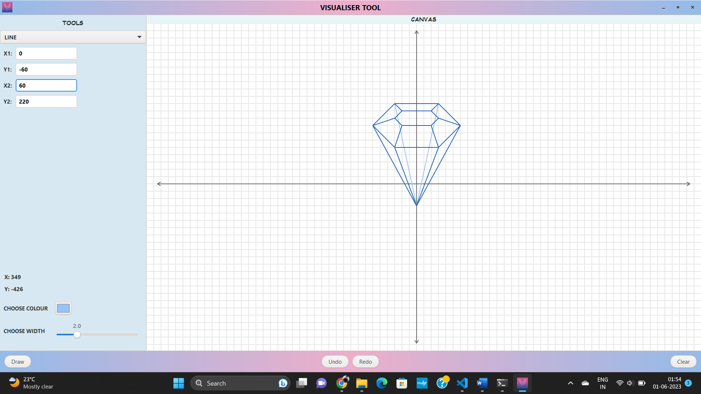

# Visualizer Tool 

A powerful Visualization tool that allows users to draw various shapes based on their input.

## Features

- Interactive drawing of shapes
- Support for multiple shape types (circle, rectangle, triangle, etc.)
- Customization options for shape properties (color, size, position)
- User-Friendly shortcuts

## InterFace

## Getting Started

### Prerequisites

- GTK+ library (version 3 or later)

### Installation

1. Clone the repository:
   
2. Install [gtk-3.0]("https://www.gtk.org/docs/installations/") into your system. (Windows and Ubuntu has to be installed differently).

3. Install [VS-Code](https://code.visualstudio.com/) for executing build command.

4. Move to cloned directory *VisualizerTool* and run build commands using shortcut **Ctrl + Shift + B**.

5. Run the generated **main.exe** file.
  

